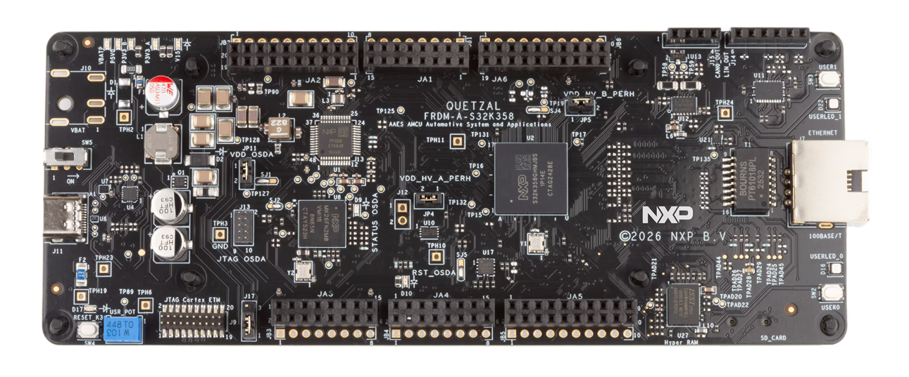
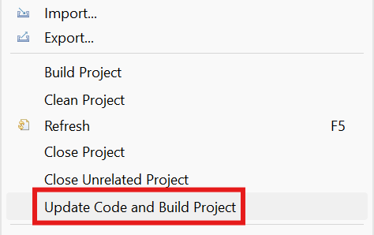
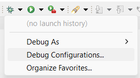
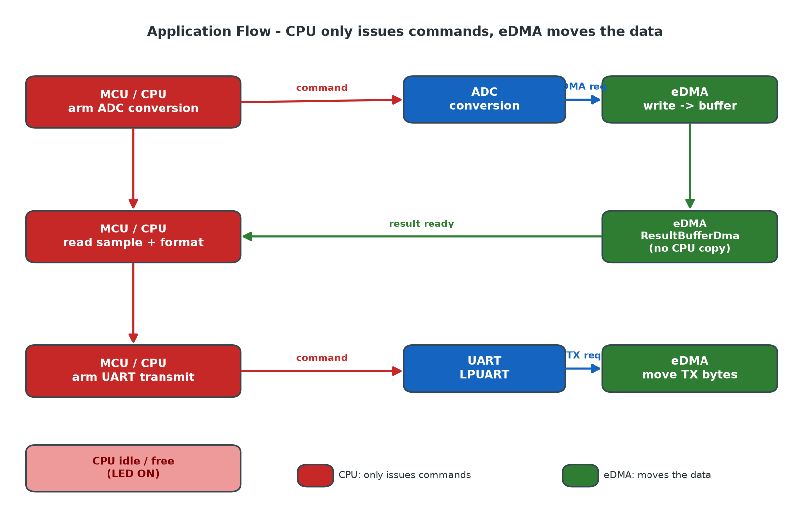

# NXP Application Code Hub
[](https://www.nxp.com)

## ADC to UART Transfer with DMA
This example shows how offloading peripheral data movement to the eDMA engine keeps the CPU free to do other work. On the FRDM-A-S32K358, an ADC group samples the on-board potentiometer (ADC2_S19, PTA17) and the conversion result is written by the DMA directly into an application buffer; the LPUART then transmits and receives data whose bytes are also moved by the DMA. In both paths the CPU only arms the transfer and can immediately continue with other tasks instead of copying bytes register-by-register. The on-board RED LED highlights the idle window during which the DMA works in the background (LED ON while the CPU waits on a background DMA transfer, OFF while it works in main), making the CPU off-load benefit visible, while the sampled ADC value can be inspected in the debugger and the periodic UART activity is printed on the serial console.


#### Boards: FRDM-A-S32K358
#### Categories: Touch Sensing
#### Peripherals: ADC, UART, DMA
#### Toolchains: S32 Design Studio IDE

## Table of Contents
1. [Software and Tools](#step1)
2. [Hardware](#step2)
3. [Setup](#step3)
4. [Results](#step4)
5. [Support](#step6)
6. [Release Notes](#step7)


## 1. Software and Tools<a name="step1"></a>
### 1.1 FRDM Automotive Bundle for S32K3
This example was developed using the FRDM Automotive Bundle for S32K3 + S32M27. To download and install the complete software and tools ecosystem, use the following link:
- [FRDM Automotive S32K3 + S32M27 Board Installation Package](https://www.nxp.com/app-autopackagemgr/automotive-software-package-manager:AUTO-SW-PACKAGE-MANAGER?currentTab=0&selectedDevices=S32K3&applicationVersionID=203)

## 2. Hardware<a name="step2"></a>
### 2.1 Required Hardware

- Personal Computer
- Type-C USB cable
- [FRDM-A-S32K358](https://www.nxp.com/design/design-center/development-boards-and-designs/FRDM-A-S32K358)[<p align="center"></p>](images/FRDM-A-S32K358.png)

### 2.2 Debugger Connection
- Connect the Type-C USB cable to PC and FRDM-A-S32K358 board for power supply and debugging

## 3. Setup<a name="step3"></a>

### 3.1 Import the Project into S32 Design Studio IDE
1. Open S32 Design Studio IDE, in the Dashboard Panel, choose **Import project from Application Code Hub**.
[<p align="center"></p>](./images/import_project_1.png)

2. Search for the project by name, open it, and click **Next>** so S32 Design Studio retrieves the project attributes.
[<p align="center"></p>](./images/import_project_3.png)

3. Select the **main** branch and then click **Next>**.
4. Select your local path in the **Destination->Directory** window, then click **Next>**.
5. Select **Import existing Eclipse projects** then click **Next>**.
6. Select the project in this repo then click **Finish**.

### 3.2 Generating, Building and Running the Example
1. In Project Explorer, right-click the project and select **Update Code and Build Project**. This will generate the configuration (Pins, Clocks, Peripherals), update the source code and build the project using the active configuration (e.g. Debug_FLASH).
Make sure the build completes successfully and the *.elf file is generated without errors.
[<p align="center"></p>](./images/update_and_build.png)
Press **Yes** in the **SDK Component Management** pop-up window to continue.

2. Go to **Debug** and select **Debug Configurations**. There will be a debug configuration for this project:
[<p align="center"></p>](./images/Debug_config.png)

        Configuration Name                  Description
        -------------------------------     -----------------------
        $(example)_debug_flash_pemicro      Debug the FLASH configuration using PEmicro probe

    Select the desired debug configuration and click on **Debug**. Now the perspective will change to the **Debug Perspective**.
    Use the controls to control the program flow.

## 4. Results<a name="step4"></a>
Once the firmware is running, the following behavior is expected:

The main loop runs as a non-blocking state machine: the CPU never busy-waits on the DMA. It only arms a transfer and then polls the completion flags without blocking, so the core stays free while the eDMA works in the background. As the diagram below shows, the MCU almost never touches the data itself - it just issues commands while the eDMA engine performs the actual data movement:

[<p align="center"></p>](./images/application_flow.png)

The end-to-end data flow for each iteration is:

1. MCU issues the ADC conversion command - Adc_Dma_Start() calls Adc_StartGroupConversion(AdcGroupSoftwareOneShotDma) to arm a software triggered one-shot conversion, then returns immediately.
2. ADC conversion done - when the conversion completes, the ADC hardware raises a DMA request.
3. DMA moves the data into the DMA buffer - the eDMA engine writes the raw ADC result directly into ResultBufferDma (no CPU copy). The group notification Notification_2 (counted by VarNotification_2) signals that a new sample is available; the state machine detects this via the non-blocking Adc_Dma_ResultReady().
4. CPU reads the sample - Adc_Dma_GetValue() calls Adc_ReadGroup to return the 14-bit right aligned result into AdcReadGroupResult; the raw DMA sample is shifted by one bit and stored into PotentiometerValue, then the value is formatted into the DMA-capable UART buffer.
5. MCU issues the UART transmit command - Uart_SendString -> Uart_AsyncSend starts the transfer, whose bytes are moved by the eDMA engine while the CPU moves on (it does not wait for the transfer to finish).


### LED behavior (CPU off-load visualization)
- RED LED ON - the CPU is idle, waiting on a background DMA transfer (ADC-to-buffer) or during the readability delay.
- RED LED OFF - the CPU is actively doing work in main (arming the ADC, reading the sample, formatting, issuing the UART transmit).

### 4.1 ADC + DMA acquisition
- Adc_Dma_Setup() initializes the ADC driver, calibrates the DMA hardware unit and binds ResultBufferDma to AdcGroupSoftwareOneShotDma (run once before the loop).
- In the loop, Adc_Dma_Start() arms the conversion, Adc_Dma_ResultReady() is polled non-blocking for the DMA-completion notification, and Adc_Dma_GetValue() reads back the DMA-moved sample.
- Verify the acquisition in the debugger by adding these watch expressions:


    ```
    ResultBufferDma      -> raw 15-bit sample written by the DMA
    AdcReadGroupResult   -> 14-bit right aligned value from Adc_ReadGroup
    PotentiometerValue   -> latest potentiometer sample (0 .. 16383)
    VarNotification_2    -> increments once per DMA-completed conversion
    ```

    Turning the potentiometer changes PotentiometerValue across the full 0 to ADC_VREFH (16383) range.

### 4.2 UART + DMA console output
- At startup the board sends a welcome banner once and then, on every loop iteration, the latest potentiometer sample, all transmitted over DMA:

    ```
    Hello from FRDM_A_S32K358 ADC + UART DMA
    ADC: 8192
    ADC: 8195
    ADC: 10230
    ...
    ```

- The ADC: value updates once per second (see UART_PERIODIC_DELAY_MS) and tracks the potentiometer position.
- The UART RX path is armed with Uart_AsyncReceive and re-armed on each completed reception from the callback (rx_counter increments per received block).


## 5. Support<a name="step6"></a>
For general technical questions related to NXP microcontrollers, please use the *[NXP Community Forum](https://community.nxp.com/)*.

#### Project Metadata

<!----- Boards ----->
[]()

<!----- Categories ----->
[](https://mcuxpresso.nxp.com/appcodehub?category=analog)

<!----- Peripherals ----->
[](https://mcuxpresso.nxp.com/appcodehub?peripheral=adc)
[](https://mcuxpresso.nxp.com/appcodehub?peripheral=dma)
[](https://mcuxpresso.nxp.com/appcodehub?peripheral=uart)

<!----- Toolchains ----->
[](https://mcuxpresso.nxp.com/appcodehub?toolchain=s32_design_studio_ide)

Questions regarding the content/correctness of this example can be entered as Issues within this GitHub repository.

>**Note**: For more general technical questions regarding NXP Microcontrollers and the difference in expected functionality, enter your questions on the [NXP Community Forum](https://community.nxp.com/)

[](https://www.youtube.com/NXP_Semiconductors)
[](https://www.linkedin.com/company/nxp-semiconductors)
[](https://www.facebook.com/nxpsemi/)
[](https://x.com/NXP)

## 6. Release Notes<a name="step7"></a>
| Version | Description / Update                           | Date                           |
|:-------:|------------------------------------------------|-------------------------------:|
| 1.0     | Initial release on Application Code Hub        | September 30<sup>th</sup> 2026  |
